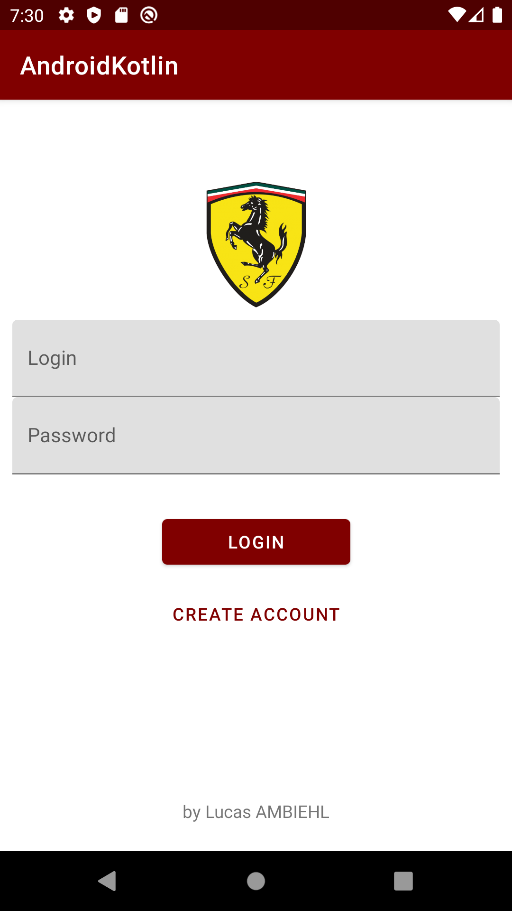
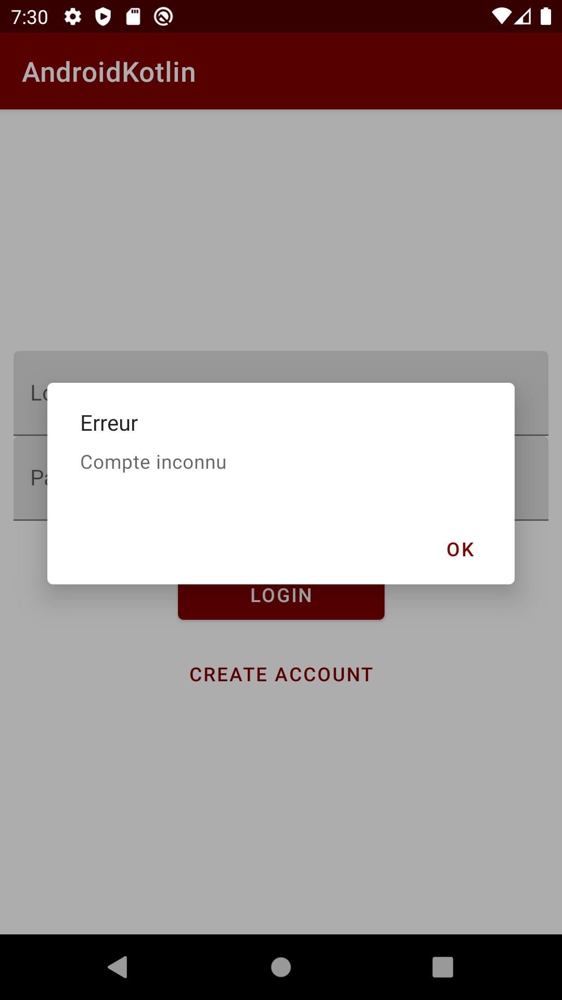
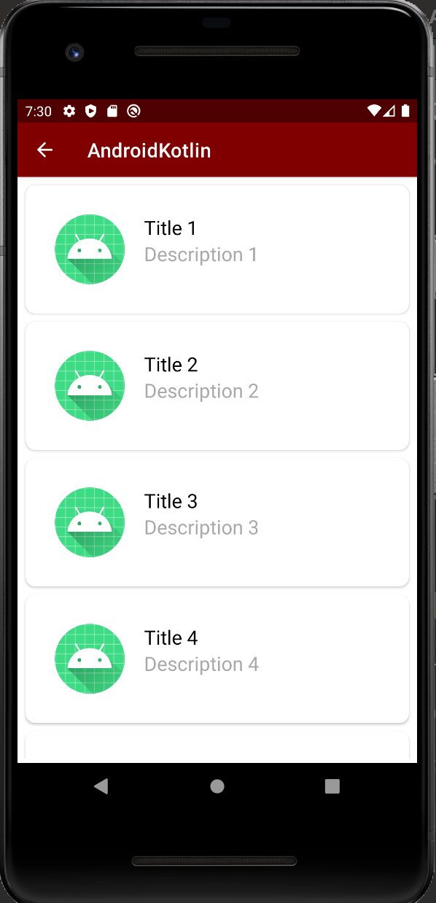
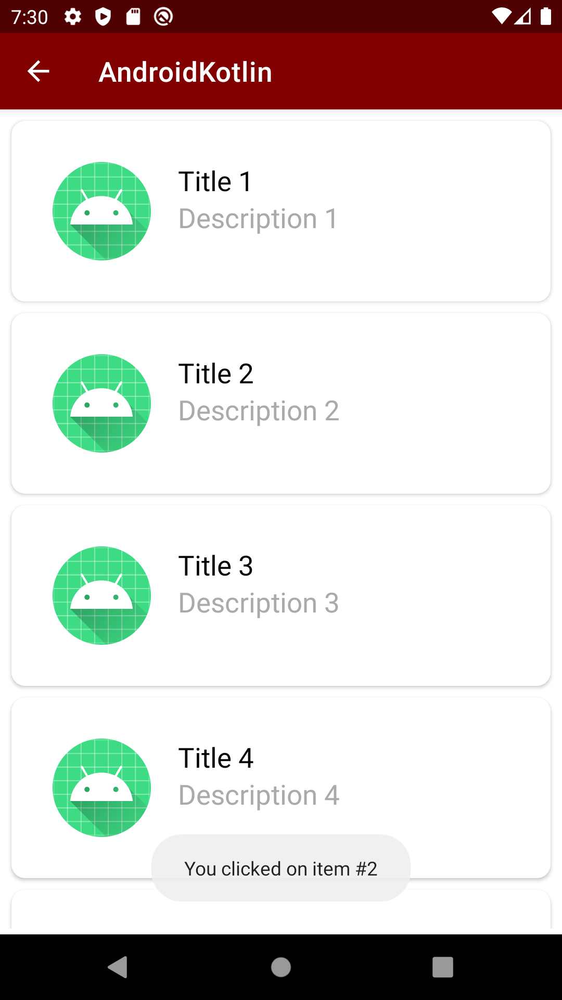
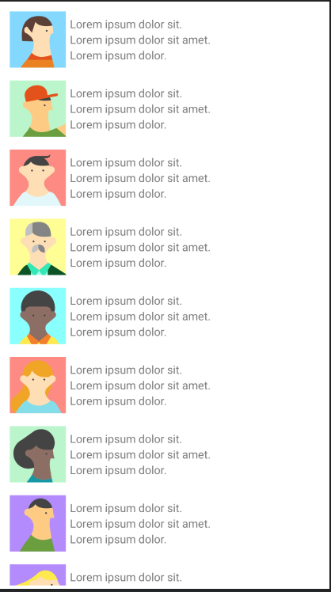

# PROJET MOBILE LUCAS AMBIEHL 4A

Création d'une application mobile affichant une liste d'éléments ainsi que leur détails

## Notation

### Notions abordées 

* Architecture *MVVM*
* Clean Architecture
* Liste affichée à l'aide d'une *RecyclerView*
* Design fonctionnel
* Travail sur Koin et Room
* Features
* Tests unitaires
* Ajout de bouton pour passer d'une activité à une autre

### Screenshots du projet 

**Ecran de connexion**  

**Erreur lorsque l'utilisateur n'est pas connu de la BDD**  

**Liste des éléments à afficher**  

**Affichage d'un toast lorsque l'on clique sur un élément de la liste**  
  

**Liste des éléments à afficher avec le sample d'Android Studio**  

## Auteur

* *AMBIEHL Lucas*

## API

Pas d'api utilisée, mais facilement intégrable avec la recycler view. Les screenshots sont avec les données sample proposées par android studio ce qui revient au même.
